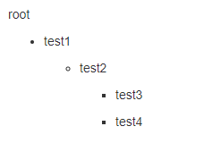
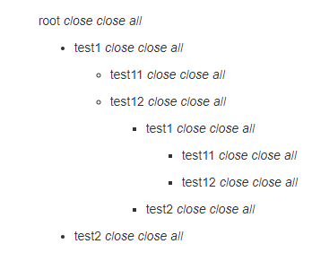

# react-tree-renderer

A tree render component for react, I want some component to render a tree without considering how to nest them, just provide the Template for One tree node. So come this project

With this you can easily customise a treeview, a json editor, or anything tree alike

## usage

install

```
npm install react-tree-renderer --save

# or

yarn add react-tree-renderer
```

### simply show

```
import TreeRenderer from 'react-tree-renderer'
const root = {
    title: 'root',
    children: [
        {
            title: 'test1',
            children: [
                {
                    title: 'test2',
                    children: [
                        {
                            title: 'test3',
                        },
                        {
                            title: 'test4',
                        }
                    ],
                },

            ],
        },
    ],
}

const Template = (props) => {
    const { data = {}, children = [], } = props
    return (
        <div>
            <p>{data.title}</p>
            <ul>
                {children.map((x, i) => (<li key={i}>{x}</li>))}
            </ul>
        </div>
    )
}

export default (props)=>(
  <TreeRenderer Template={Template} data={root} />
)

```


### with data updating

Template

```
import React from 'react'

export default class DefaultTemplate extends React.Component {

  handleUpdateTitle(e) {
    const { data = {}, updateData, } = this.props
    const title = e.target.value

    updateData({
      ...data,
      title
    })
  }

  handleAddChild() {
    const { data = {}, updateData, } = this.props
    const { children = [] } = data

    updateData({
      ...data,
      children: [
        ...children,
        { title: 'new' },
      ]
    })
  }

  render() {
    const { data = {}, children = [], } = this.props
    
    return (
      <div>
        <input value={data.title} onChange={this.handleUpdateTitle.bind(this)} />
        <ul>
          {children.map((x, i) => (<li key={i}>{x}</li>))}
        </ul>
        <button onClick={this.handleAddChild.bind(this)}>+</button>
      </div>
    )
  }
}
```

container

```
import React from 'react'

import TreeRenderer from 'react-tree-renderer'
import DefaultTemplate from './DefaultTemplate'


export default class TestTree extends React.Component {

  constructor(props, ctx) {
    super(props, ctx)
    this.state = {
      root: {
        title: 'root',
        children: [
          {
            title: 'test1',
          }
        ]
      }
    }
  }

  onUpdateData(root) {
    this.setState(
      { root, }
    )
  }

  render() {
    const onUpdateData = this.onUpdateData.bind(this)
    const { root = {} } = this.state

    return (<TreeRenderer Template={DefaultTemplate} data={root} onUpdateData={onUpdateData} />)

  }
}
```


### with event

Template

```
import React from 'react'

export const eventTypes = {
  closeAll: 'closeAll',
  openAll: 'openAll'
}

export default class DefaultTemplate extends React.Component {

  handleOpen(isOpen) {
    const { data = {}, updateData, } = this.props

    updateData({
      ...data,
      isOpen,
    })
  }

  handleOpenAll(isOpen) {
    const { treeEvent } = this.props
    treeEvent(isOpen ? eventTypes.openAll : eventTypes.closeAll)
  }

  render() {
    const { data = {}, children = [], } = this.props
    const handleOpen = this.handleOpen.bind(this)
    const handleOpenAll = this.handleOpenAll.bind(this)

    const getControls = (isOpen) => {
      if (isOpen) {
        return (<em><span onClick={() => handleOpen(false)}>close</span> <span onClick={() => handleOpenAll(false)}>close all</span></em>)
      }
      return (<em><span onClick={() => handleOpen(true)}>open</span> <span onClick={() => handleOpenAll(true)}>open all</span></em>)
    }

    return (
      <div>
        <p>{data.title} {getControls(data.isOpen)}</p>
        <ul style={{ display:data.isOpen?'block':'none'}}>
          {children.map((x, i) => (<li key={i}>{x}</li>))}
        </ul>
      </div>
    )
  }
}
```

container

```
import React from 'react'

import { default as TreeRenderer, pathGet, pathMerge } from 'react-tree-renderer'
import { default as DefaultTemplate, eventTypes } from './DefaultTemplate'


export default class TestTree extends React.Component {

  constructor(props, ctx) {
    super(props, ctx)
    this.state = {
      root: {
        title: 'root',
        children: [
          {
            title: 'test1',
            children: [
              {
                title: 'test11',
              },
              {
                title: 'test12', children: [
                  {
                    title: 'test1',
                    children: [
                      {
                        title: 'test11',
                      },
                      {
                        title: 'test12',
                      }
                    ],
                  },
                  {
                    title: 'test2',
                  }
                ],
              }
            ],
          },
          {
            title: 'test2',
          }
        ],
      }
    }
  }

  onUpdateData(root) {
    this.setState(
      { root, }
    )
  }

  onTreeEvent(eventStr, eventData, path) {
    const { root = {} } = this.state
    const obj = pathGet(root, path)

    const setOpenRecursive = (isOpen, obj) => {
      const { children = [] } = obj
      return {
        ...obj,
        isOpen,
        children: children.map(x => setOpenRecursive(isOpen, x))
      }
    }
    const updateState = (newObj) => {
      const newRoot = pathMerge(root, path, newObj)
      this.setState({
        root: newRoot,
      })
    }

    switch (eventStr) {
      case eventTypes.closeAll:
        updateState(setOpenRecursive(false, obj))
        break;
      case eventTypes.openAll:
        updateState(setOpenRecursive(true, obj))
        break;
      default:
        break;
    }
  }


  render() {
    const onUpdateData = this.onUpdateData.bind(this)
    const onTreeEvent = this.onTreeEvent.bind(this)
    const { root = {} } = this.state

    return (<TreeRenderer Template={DefaultTemplate} data={root} onUpdateData={onUpdateData} onTreeEvent={onTreeEvent} />)

  }
}
```

